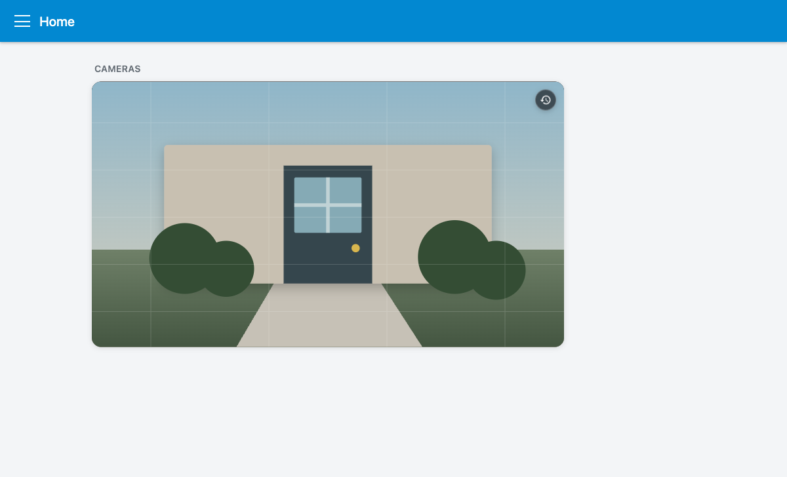
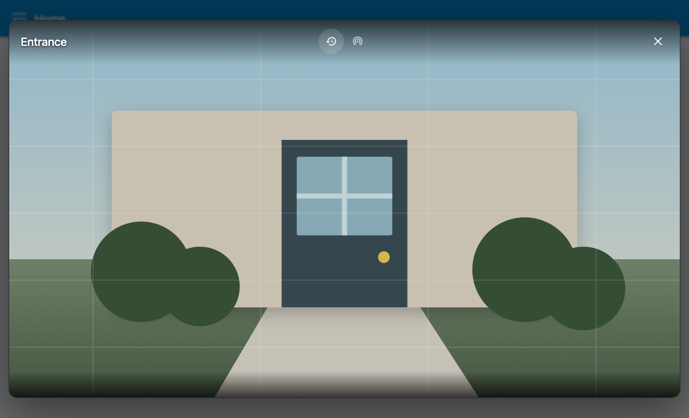

# Ring View

A Home Assistant Lovelace card that keeps a recent Ring recording and a real Ring live camera one tap apart. The dashboard uses only a still preview. A live Ring session is created only after the viewer opens and **Live** is selected.





## Highlights

- Native-feeling `picture-entity` dashboard preview
- Native-sized still thumbnails for sharp previews without starting a live session
- One consistent mode language across the preview and viewer: history for the
  last recording and a red dot for **Live**
- Compact, centered icon controls with tooltips and 44-pixel touch targets
- One active native camera renderer at a time
- Hard stream teardown on mode change, close, card removal, browser Back, and hidden tabs
- Native Home Assistant WebRTC/HLS/MJPEG selection through `ha-camera-stream`
- Fullscreen, keyboard navigation, focus trapping, safe-area handling, and screen-reader status messages
- Home Assistant-native card editor with camera-only entity pickers, compact expandable sections, and capability warnings
- No Ring credentials, direct Ring requests, analytics, Browser Mod, or persisted camera URLs

## Requirements and compatibility

- Home Assistant 2026.7 or newer
- A recording camera entity and a separate live camera entity
- Current Chrome, Edge, Firefox, or Safari, including Home Assistant Companion app webviews

The primary tested entity shape is:

```text
camera.front_door
camera.front_door_live_view
```

The card uses Home Assistant’s internal `ha-camera-stream` component because native WebRTC/HLS selection and Ring’s MJPEG recording fallback are core product requirements. Home Assistant does not promise this internal element as a stable public API. All access is isolated in [`src/media/native-camera-adapter.ts`](src/media/native-camera-adapter.ts), feature-detected, lazy-loaded, and protected by fallbacks. See [COMPATIBILITY.md](COMPATIBILITY.md) for the support policy.

## Installation with HACS

1. In HACS, open **Frontend**.
2. Use the menu to choose **Custom repositories**.
3. Add this repository URL and select **Dashboard** as the category.
4. Install **Ring View**.
5. Refresh Home Assistant. A hard refresh may be required after an upgrade.

HACS should register `/hacsfiles/ring-view/ring-view.js` as a JavaScript module automatically.

## Manual installation

1. Download `ring-view.js` from the latest release.
2. Copy it to `<config>/www/ring-view.js`.
3. Add `/local/ring-view.js` as a **JavaScript module** under **Settings → Dashboards → Resources**.
4. Refresh the browser.

## Minimal configuration

```yaml
type: custom:ring-view
recording_entity: camera.front_door
live_entity: camera.front_door_live_view
```

## Full example

```yaml
type: custom:ring-view

recording_entity: camera.front_door
live_entity: camera.front_door_live_view
name: Entrance

default_mode: last_recording
live_muted: false
show_name: false
aspect_ratio: "16:9"
fit_mode: cover

grid_options:
  columns: 12
  rows: 3
```

All options shown above match the built-in defaults except `name` and `grid_options`, which are optional. The graphical editor keeps the two camera sources visible and places the less-frequent viewer and appearance choices in compact, native expandable sections. Home Assistant supplies the live preview on the right, so the editor does not render a second copy.

Version 0.2 uses this flat configuration only. The older nested `preview`, `appearance`, `viewer`, and `performance` options are intentionally not supported.

### Preview semantics

Like Home Assistant's native picture card, the dashboard always asks Home
Assistant's authenticated camera proxy for a still from the last-recording
camera, sized to the rendered card and the screen pixel density. It refreshes
that still image every ten seconds only while the card and browser tab are
visible, and updates the requested size after a meaningful resize. It never mounts
`ha-camera-stream`, preconnects to the live entity, or starts a Ring live session
on the dashboard. The icon at the top right describes what opening the card will
do without covering the image with text:

- A **history** icon when the viewer opens on the latest recording
- A **red dot** when the viewer opens on Live

## Failure behavior

- Missing or unavailable entities are reported immediately.
- Live connection attempts time out after 20 seconds and retry once.
- If Home Assistant’s internal camera component cannot load, a recording may fall back to an ephemeral native `<video>` using the current `video_url`. That URL is never copied into configuration, storage, or logs.
- Live mode offers the normal Home Assistant camera dialog if native rendering is incompatible.

## Development

Node.js 20 or newer is required.

```bash
npm install
npm run check
npm test
npm run test:browser
npm run build
```

The production artifact is `dist/ring-view.js`. The browser suite uses the local demo harness and mocked camera elements; it verifies UI behavior and renderer teardown without opening Ring sessions.

Real Home Assistant/Ring verification is intentionally manual because it requires an authenticated Home Assistant installation and actual camera entities. Follow [TESTING.md](TESTING.md) before a release.

## Security and privacy

- The card communicates only with Home Assistant-provided entities and frontend components.
- It contains no Ring authentication, external scripts, remote fonts, telemetry, or analytics.
- Camera tokens, authenticated URLs, and `video_url` values are never logged or persisted.
- Recording and live playback start with audio after the user opens or selects
  them, matching Home Assistant's native camera viewer. Audio and fullscreen
  remain in the native media control bar. If a browser rejects audible
  autoplay, the card retries muted.

## Rollback

See [ROLLBACK.md](ROLLBACK.md). In short: restore the previous HACS version, refresh the resource cache, and keep the existing native cards available until the custom card has passed real-device verification. This project never modifies or replaces dashboard cards automatically.

## License

[MIT](LICENSE)
